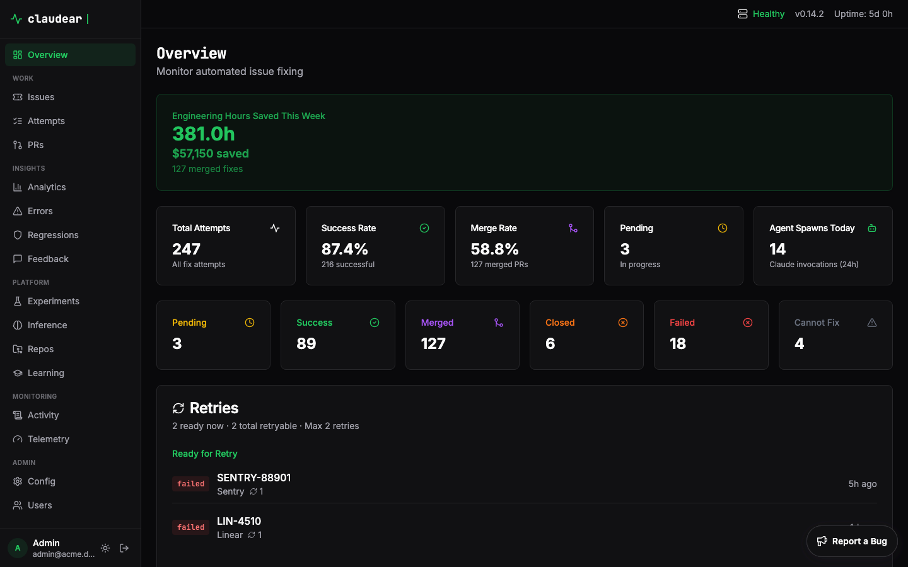
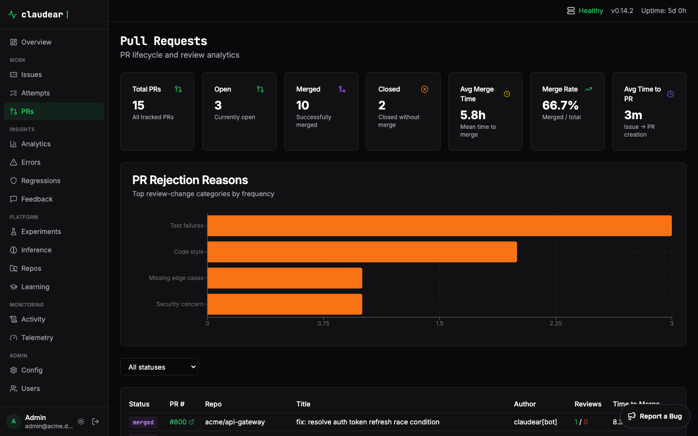

<p align="center">
  <h1 align="center">Claudear</h1>
  <p align="center">
    <strong>Autonomous issue-to-PR pipeline powered by Claude Code</strong>
  </p>
  <p align="center">
    <a href="https://github.com/abnegate/claudear/actions/workflows/ci.yml"></a>
    <a href="https://github.com/abnegate/claudear/releases"></a>
    <a href="https://github.com/abnegate/claudear/blob/main/LICENSE"></a>
    <a href="https://github.com/abnegate/claudear"></a>
  </p>
</p>

Claudear watches your issue trackers and error monitoring services, automatically spawning [Claude Code](https://docs.anthropic.com/en/docs/claude-code) agents to fix issues and open pull requests: no human in the loop required (unless Claude has a question for you).

Point it at Linear, Sentry, Jira, GitLab, Discord, Slack, or GitHub review comments. It figures out which repo the issue belongs to, clones it, runs Claude Code (or Codex) with your project's conventions, opens a PR, monitors the PR through merge, auto-resolves the source issue, and learns from the outcome to get smarter over time.

---

## Table of Contents

- [How It Works](#how-it-works)
- [Features](#features)
- [Architecture](#architecture)
- [Installation](#installation)
- [Quick Start](#quick-start)
- [Configuration](#configuration)
- [Usage](#usage)
  - [Daemon Mode](#daemon-mode)
  - [Polling Mode](#polling-mode-foreground)
  - [Webhook Mode](#webhook-mode)
  - [Manual Triggers](#manual-triggers)
  - [PR Management](#pr-management)
  - [Retry Management](#retry-management)
  - [Dashboard](#dashboard)
  - [Scheduled Reports](#scheduled-reports)
  - [Multi-Repository Cascading](#multi-repository-cascading)
  - [Human Q&A Loop](#human-qa-loop)
  - [Inference Analytics](#inference-analytics)
  - [Release Tracking](#release-tracking)
  - [Diagnostics](#diagnostics)
  - [Code Chat](#code-chat)
  - [Dry Run](#dry-run)
  - [User Registry](#user-registry)
- [Fix Attempt Lifecycle](#fix-attempt-lifecycle)
- [AI Feedback Loop](#ai-feedback-loop)
  - [Embedding-Based Learning](#embedding-based-learning)
  - [Continuous Learning Pipeline](#continuous-learning-pipeline)
- [Custom Prompt Templates](#custom-prompt-templates)
  - [A/B Experiments](#ab-experiments)
- [Running as a Service](#running-as-a-service)
- [Docker](#docker)
- [CI/CD](#cicd)
- [Development](#development)
- [License](#license)

---

## How It Works

```
 Linear   Sentry   Jira   GitLab   Discord   Slack   Telegram   WhatsApp   GitHub Reviews
   |        |       |       |         |        |        |          |             |
   +--------+-------+-------+---------+--------+--------+----------+-------------+
                                      |
                                      v
          ┌──────────────────────────────────────────────────────────────────────────────┐
          |                              Claudear Watcher                                |
          |                                                                              |
          |   1. Detect new issue (poll or webhook)                                      |
          |   2. Prioritise by severity, frequency, blast radius, and clustering         |
          |   3. Infer target repository from stack traces, file paths, context          |
          |   4. Clone repo, spawn Claude Code / Codex agent with project conventions    |
          |   5. Self-evaluate the fix (tests, lint, static analysis, coverage)          |
          |   6. Create a PR, notify you (Discord / Slack / Email / SMS / Push / ...)    |
          |   7. Monitor PR through merge, auto-resolve issue on source                  |
          |   8. Watch for regressions for 24 hours                                      |
          |   9. Extract learnings from outcomes, diffs, and reviews                     |
          |  10. Cascade fixes through downstream dependency repos                       |
          └──────────────────────────────────────────────────────────────────────────────┘
```

---

## Features

### Issue Sources
- **Linear**: Trigger on labels (`auto-implement`, `claude`) or states (`backlog`, `todo`), with team/project filtering and assignee triggers
- **Sentry**: Process top escalating errors by event count, time period, and escalation threshold
- **Jira**: JQL-based issue filtering with label, status, issue type, and assignee support (Cloud + Server/DC)
- **GitHub Issues**: Monitor issues across repositories with label and state triggers
- **GitLab**: Fetch issues from GitLab groups and projects with label and state triggers
- **Discord**: Process messages and threads from Discord channels as issues
- **Slack**: Poll Slack channels for messages as issues
- **WhatsApp**: Receive WhatsApp messages via Cloud API webhooks
- **Telegram**: Poll Telegram chats via Bot API
- **GitHub Review Comments**: Respond to PR review comments tagged with `@claudear`, with `allowed_bots` to process comments from specific bots (e.g., Copilot)
- **GitLab MR Comments**: Respond to MR review comments tagged with `@claudear`, with `allowed_bots` support
- Per-source rate limiting, concurrent processing controls, and configurable poll intervals

### Intelligent Repository Routing
- Automatically determines the target repository from stack traces, file paths, and issue content
- Confidence scoring ranks repository matches so fixes go to the right place
- Scans configured GitHub organizations and local paths for repo discovery
- Full-text file index across all repositories for fast context lookups

### Autonomous Fix Pipeline
- Spawns real Claude Code or Codex processes with full tool access (read, edit, bash, etc.)
- Multi-provider support: Claude Code (primary), OpenAI Codex, with Gemini and Copilot planned
- A/B experiment infrastructure: test providers against each other with weighted routing
- Configurable model selection: Sonnet, Opus, Haiku, or any model ID
- Separate `classification_model` for repo routing (use a cheaper model like Haiku for classification)
- Project-specific `AGENT.md` files customize coding conventions per repo
- Global instructions and tool permissions via `claudear.toml`
- Configurable execution timeout (default 6 hours)

### Multi-Repository Cascading
- Tracks dependency graphs between repositories (NPM, Python, etc.)
- Automatically propagates fixes through dependent repos using BFS traversal
- Configurable cascade depth limits

### Human Q&A Loop
- When Claude is blocked on ambiguity, it asks a question via your notification channels
- Claudear fans out the question to all enabled notifiers (Discord, Slack, Email, etc.)
- Reply-capable channels: Discord, Slack, and Email — first reply wins
- Q&A pairs are stored and reused via embedding-based semantic matching so the same question is never asked twice
- Scoped matching (source+repo at 0.82 threshold) with global fallback (0.88 threshold)
- Configurable timeouts with best-effort continuation

### AI Feedback Loop
- Tracks outcomes of every fix attempt (merged, closed, failed)
- Generates local vector embeddings for all issue content (no external APIs: runs on ONNX Runtime)
- Finds similar past issues and extracts patterns from successes and failures
- Enhances future prompts with learnings from past outcomes
- Supported models: Nomic, MiniLM, BGE

### Prioritisation Engine
- Composite severity scoring from multiple signals: severity (30%), frequency (25%), regression risk (20%), blast radius (15%), clustering (10%)
- Blast radius classification: 5 tiers from critical (auth/payment) to cosmetic (docs)
- Content clustering: groups similar issues by error type, culprit, and title similarity
- Suppression rules: skip known-noisy issues with pattern matching (contains, regex) before they consume processing slots
- Configurable weights and path patterns per tier

### Self-Evaluation
- Before/after comparison of tests, lint, static analysis, and code coverage
- Auto-detects project tooling or accepts custom commands
- Posts evaluation results as PR comments
- Optionally fails fix attempts on quality regressions
- Per-tool and total timeout configuration

### Continuous Learning
- Extracts learnings from Claude's execution logs automatically
- Analyzes PR diffs on merge to extract coding patterns
- Promotes repeated Q&A answers to standing instructions (configurable threshold)
- Accumulates per-repository knowledge from successful fixes
- Classifies reviewer feedback patterns and promotes common fixes
- Tracks Claude's problem-solving strategies per issue type
- Scores fix quality based on merge velocity
- Detects clusters of correlated issues within configurable time windows
- Cross-repo failure correlation detection
- Optionally auto-generates `AGENT.md` from accumulated knowledge

### Code Indexing
- Tree-sitter based parsing for 12+ languages (Rust, JS, TS, Python, Go, Java, C, C++, Ruby, PHP, Swift, Kotlin)
- Semantic search across all repositories via embeddings
- Configurable file size limits and batch sizes

### PR Lifecycle Management
- Monitors PRs through merge/close with configurable poll intervals
- Automatically resolves source issues (Linear/Sentry) when PRs merge
- Exponential backoff retries for failed or closed PRs (configurable max retries)
- Full lifecycle tracking: Pending -> Success -> Merged -> Resolved (with retry paths)

### Regression Monitoring
- Hourly checks for 24 hours after a fix deploys
- Detects re-opened issues and error rate spikes on both Linear and Sentry
- Configurable similarity thresholds and event count minimums

### Release Tracking
- Dependency-aware release detection across repository graphs
- Tracks when fixes land in production through dependency paths
- Semantic versioning support

### Notifications
- **Discord**: Webhook messages + bot reply polling for Q&A, rich embeds, thread tracking
- **Slack**: Bot API messages + reply polling for Q&A, webhook alternative
- **Email**: SMTP sending + IMAP reply polling for Q&A
- **SMS**: Twilio integration
- **Push**: Pushover notifications with priority levels
- **WhatsApp**: WhatsApp Business Cloud API
- **Telegram**: Telegram Bot API with HTML formatting
- **Console**: Always-on logging
- Mix and match any combination of channels

### User Registry
- Map team members across Linear, GitHub, Sentry, Jira, GitLab, Discord, Slack, Email, SMS, Push, WhatsApp, Telegram
- Route notifications to the person assigned to the issue
- Per-user notification channel preferences

### Analytics Dashboard
- Live web UI (React + TypeScript + Tailwind)
- Stats overview: total attempts, success rate, merge rate, cost estimates
- Status breakdown, source-by-source metrics, recent attempt history
- PR analytics: review metrics, merge rates, rejection analysis
- Cost estimation with configurable engineer hourly rate for ROI calculation
- Retryable issues view with one-click retry
- Embedded in the release binary: no separate deployment needed

### Scheduled Reports
- Daily, weekly, and monthly automated status reports
- Breakdown of attempts, success/failure rates, PR metrics, pending work
- Delivered via all configured notification channels

### Daemon Mode & IPC
- Runs as a background service with full IPC control
- `start` / `stop` / `pause` / `resume` / `status` / `activity` commands
- Unix socket communication with configurable timeout

### Security
- API security headers (HSTS, X-Content-Type-Options, X-Frame-Options)
- CSRF protection with double-submit cookie pattern
- Extended rate limiting per endpoint
- Idle session timeout with automatic cleanup
- Password hashing (bcrypt) and encrypted session tokens

### Webhooks
- Real-time event processing from all configured sources (Linear, Sentry, GitHub, GitLab, Jira, Slack, Discord, Telegram, WhatsApp)
- HMAC-SHA256 signature verification
- One-command auto-configuration: `claudear webhook --setup --base-url <url>`

### Integrations at a Glance

| Category | Integration | Protocol | Notes |
|----------|------------|----------|-------|
| **Issue Sources** | Linear | REST API | Labels, states, team/project filters |
| | Sentry | REST API | Escalating errors, event thresholds |
| | Jira | REST API | JQL queries, labels, status filters (Cloud + Server/DC) |
| | GitHub Issues | REST API | Cross-repo monitoring |
| | GitLab | REST API | Group and project issues |
| | Discord | Bot API | Channel messages and threads |
| | Slack | Bot API | Channel message polling |
| | WhatsApp | Cloud API | Webhook-fed message buffer |
| | Telegram | Bot API | `getUpdates` long-polling |
| **SCM** | GitHub | REST + Git | PRs, review comments, webhooks, App auth, bot comment processing |
| | GitLab | REST + Git | MRs, issue resolution, review comments, bot comment processing |
| **Notifications** | Console | stdout | Always-on logging |
| | Discord | Webhook + Bot | Rich embeds, reply-based Q&A, thread tracking |
| | Slack | Bot API + Webhook | Messages, reply-based Q&A |
| | Email | SMTP + IMAP | Send + reply polling for Q&A |
| | SMS | Twilio API | Text message alerts |
| | Push | Pushover API | Mobile push notifications |
| | WhatsApp | Cloud API | WhatsApp Business messages |
| | Telegram | Bot API | Chat messages with HTML formatting |
| **Agent Runners** | Claude Code | CLI | Primary runner, full tool access |
| | Codex | CLI | OpenAI Codex runner |
| | Gemini | CLI | Google Gemini *(planned)* |
| | Copilot | CLI | GitHub Copilot *(planned)* |
| **Storage** | SQLite | Local file | WAL mode, Vectorlite extension |
| **Embeddings** | Nomic | ONNX | Default model, local inference |
| | MiniLM | ONNX | Lightweight alternative |
| | BGE | ONNX | BAAI general embedding |
| **Code Indexing** | Tree-sitter | Local | 12+ languages, semantic search |

---

## Architecture

```
┌──────────────────────────────────────────────────────────────────────────────┐
│                                  Claudear                                    │
├──────────────────────────────────────────────────────────────────────────────┤
│                                                                              │
│  ┌────────┐ ┌────────┐ ┌──────┐ ┌────────┐ ┌─────────┐ ┌───────┐          │
│  │ Linear │ │ Sentry │ │ Jira │ │ GitLab │ │ Discord │ │ Slack │ ← Sources│
│  └───┬────┘ └───┬────┘ └──┬───┘ └───┬────┘ └────┬────┘ └──┬────┘          │
│      │          │         │         │           │         │                │
│      └────┬─────┴────┬────┴────┬────┴─────┬─────┴────┬────┘                │
│           │          │         │          │          │                      │
│           ▼          ▼         ▼          ▼          ▼                      │
│    ┌──────────────────────────────────────────────────────┐                 │
│    │                    Watcher                           │                 │
│    │  (polls, webhooks, prioritises, matches, rate-limits)│                 │
│    └───────────────────────┬──────────────────────────────┘                 │
│                            │                                                │
│    ┌───────────┬───────────┼──────────┬──────────┬───────────┐             │
│    │           │           │          │          │           │             │
│    ▼           ▼           ▼          ▼          ▼           ▼             │
│ ┌────────┐ ┌────────┐ ┌────────┐ ┌────────┐ ┌────────┐ ┌──────────┐     │
│ │Prioriti│ │  Agent │ │Notifier│ │   PR   │ │  Self  │ │  Repo    │     │
│ │-sation │ │ Runner │ │(Discord│ │Monitor │ │  Eval  │ │  Index   │     │
│ │ Engine │ │(Claude,│ │ Slack, │ │        │ │(tests, │ │(tree-sit,│     │
│ │        │ │ Codex) │ │Email..)│ │        │ │ lint)  │ │inference)│     │
│ └────────┘ └────────┘ └────────┘ └────────┘ └────────┘ └──────────┘     │
│                                                                            │
│ ┌────────┐ ┌────────┐ ┌────────┐ ┌────────┐ ┌────────┐ ┌──────────┐     │
│ │Learning│ │Regress-│ │Release │ │Cascade │ │  IPC   │ │ SQLite + │     │
│ │ System │ │  ion   │ │Tracker │ │ Engine │ │(daemon)│ │Vectorlite│     │
│ └────────┘ └────────┘ └────────┘ └────────┘ └────────┘ └──────────┘     │
│                                                                            │
│ ┌──────────────────────────────────────────────────────────────────────┐   │
│ │                     Dashboard (React + Tailwind)                     │   │
│ │  Stats · Analytics · PRs · Attempts · Retries · Reports · Config    │   │
│ └──────────────────────────────────────────────────────────────────────┘   │
│                                                                            │
└──────────────────────────────────────────────────────────────────────────────┘
```

---

## Installation

### Homebrew (macOS/Linux)

```bash
brew tap abnegate/tap
brew install claudear
```

### APT (Debian/Ubuntu)

```bash
curl -fsSL https://abnegate.github.io/apt-repo/pubkey.gpg | sudo gpg --dearmor -o /usr/share/keyrings/claudear.gpg
echo "deb [signed-by=/usr/share/keyrings/claudear.gpg] https://abnegate.github.io/apt-repo stable main" | sudo tee /etc/apt/sources.list.d/claudear.list
sudo apt update && sudo apt install claudear
```

### Pre-built Binaries

Download from the [releases page](https://github.com/abnegate/claudear/releases) (Linux, macOS Intel/ARM).

### From Source

```bash
git clone https://github.com/abnegate/claudear.git
cd claudear
cargo build --release
# Binary at target/release/claudear
```

### Docker

```bash
docker pull ghcr.io/abnegate/claudear:latest
```

---

## Quick Start

```bash
# 1. Create your config file
cp claudear.example.toml claudear.toml
# Edit claudear.toml with your API keys (issues.linear.api_key, scm.github.token, etc.)

# 2. Seed existing issues (so Claudear doesn't process old issues)
claudear seed

# 3. Start watching (daemon mode with polling + webhooks + dashboard)
claudear start --poll --port 3100

# 4. Open the dashboard
open http://localhost:3100
```

That's it. Label a Linear issue with `auto-implement` or `claude`, and Claudear will pick it up, fix it, and open a PR.

---

## Configuration

Claudear uses a TOML configuration file. Copy the example and customize:

```bash
cp claudear.example.toml claudear.toml
```

By default, Claudear looks for `claudear.toml` in the current directory. Override with:

```bash
claudear --config /path/to/config.toml poll
```

### Environment Variable Overrides

All config values can be overridden with environment variables, useful for keeping secrets out of version control and for container deployments:

| Variable | Config Path |
|----------|-------------|
| `CLAUDEAR_LINEAR_API_KEY` | `issues.linear.api_key` |
| `CLAUDEAR_SENTRY_AUTH_TOKEN` | `issues.sentry.auth_token` |
| `CLAUDEAR_GITHUB_TOKEN` | `scm.github.token` |
| `CLAUDEAR_GITLAB_TOKEN` | `scm.gitlab.token` |
| `CLAUDEAR_JIRA_API_TOKEN` | `issues.jira.api_token` |
| `CLAUDEAR_LINEAR_WEBHOOK_SECRET` | `issues.linear.webhook_secret` |
| `CLAUDEAR_SENTRY_CLIENT_SECRET` | `issues.sentry.client_secret` |
| `CLAUDEAR_GITHUB_WEBHOOK_SECRET` | `scm.github.webhook_secret` |
| `CLAUDEAR_GITLAB_WEBHOOK_SECRET` | `scm.gitlab.webhook_secret` |
| `CLAUDEAR_EMBEDDING_MODEL` | Embedding model (`nomic`, `minilm`, `bge`) |
| `CLAUDEAR_EMBEDDING_CACHE_DIR` | Embedding model cache directory |
| `CLAUDEAR_SENTRY_DSN` | Sentry DSN for backend error reporting |
| `CLAUDEAR_SENTRY_RELEASE` | Sentry release tag |
| `CLAUDEAR_SENTRY_ENVIRONMENT` | Sentry environment name |
| `CLAUDEAR_TELEGRAM_WEBHOOK_SECRET` | Telegram webhook secret token |
| `CLAUDEAR_WHATSAPP_WEBHOOK_VERIFY_TOKEN` | WhatsApp webhook verify token |
| `CLAUDEAR_VECTORLITE_PATH` | Path to vectorlite SQLite extension |
| `CLAUDEAR_TLS_ENABLED` | `tls.enabled` |
| `CLAUDEAR_TLS_DOMAINS` | `tls.domains` (comma-separated) |
| `CLAUDEAR_TLS_EMAIL` | `tls.email` |
| `CLAUDEAR_TLS_PRODUCTION` | `tls.production` |
| `CLAUDEAR_TLS_CACHE_DIR` | `tls.cache_dir` |
| `CLAUDEAR_TLS_HTTPS_PORT` | `tls.https_port` |
| `CLAUDEAR_TLS_HTTP_REDIRECT_PORT` | `tls.http_redirect_port` |
| `CLAUDEAR_DISCORD_BOT_TOKEN` | `notifiers.discord.bot_token` |
| `CLAUDEAR_SLACK_BOT_TOKEN` | `notifiers.slack.bot_token` |

### Minimal Configuration

```toml
workspace = "~/.claudear/repos"

known_orgs = ["your-github-org"]

auto_discover_paths = ["~/projects"]

[issues.linear]
api_key = "lin_api_xxxx"
```

### Configuration Reference

| Section | Description |
|---------|-------------|
| `workspace` | Directory where repositories are cloned **(required)** |
| `known_orgs` | GitHub organizations to track for auto-discovery |
| `auto_discover_paths` | Local paths to scan for repository clones |
| `poll_interval_ms` | Polling interval in milliseconds (default: 300000 = 5 min) |
| `db_path` | SQLite database path (default: `./claudear.db`) |
| `webhook_port` | Webhook server port (default: 3100) |
| `bind_address` | HTTP server bind address (default: `127.0.0.1`, use `0.0.0.0` for Docker) |
| `max_issues_per_cycle` | Max issues per poll cycle (default: 5) |
| `max_concurrent` | Max concurrent issue processing (default: 1) |
| `processing_delay_ms` | Delay between processing issues in ms (default: 5000) |
| `agent` | Agent provider config, model, instructions, permissions, A/B experiments (see [Custom Prompt Templates](#custom-prompt-templates)) |
| `issues.linear` | Linear API key, trigger labels/states/assignees, team/project filters, rate limits |
| `issues.sentry` | Sentry auth token, org slug, project filters, escalation thresholds |
| `issues.jira` | Jira base URL, auth, project keys, JQL filters, issue types |
| `issues.discord` | Discord bot token, listen channel ID |
| `issues.slack` | Slack bot token, listen channel ID |
| `scm.github` | GitHub token, PR poll interval, auto-resolve on merge, review trigger tag, allowed bots |
| `scm.github.app` | GitHub App authentication (App ID, private key, installation ID) |
| `scm.gitlab` | GitLab token, base URL, groups, MR poll interval, review trigger tag, allowed bots |
| `notifiers.discord` | Discord webhook URL, bot token, channel ID for Q&A |
| `notifiers.slack` | Slack bot token, channel ID, webhook URL for Q&A |
| `notifiers.email` | SMTP sending + IMAP reply polling |
| `notifiers.sms` | Twilio account SID, auth token, phone numbers |
| `notifiers.push` | Pushover API token, user key, priority |
| `notifiers.whatsapp` | WhatsApp phone number ID, access token, recipient numbers |
| `notifiers.telegram` | Telegram bot token, chat ID, recipient chat IDs |
| `ask` | Human Q&A loop: timeout, poll interval, max rounds, semantic thresholds |
| `retry` | Max retries, base delay, max delay (exponential backoff) |
| `regression` | Check interval, monitoring duration, event thresholds |
| `cascade` | Enable/disable cascading, max depth, per-dependency rules |
| `learning` | Continuous learning: log extraction, diff analysis, Q&A promotion, repo knowledge |
| `prioritisation` | Composite scoring weights, blast radius paths, clustering, suppression rules |
| `code_index` | Tree-sitter code indexing: enable, file size limits, batch size |
| `evaluation` | Self-evaluation: test/lint/coverage deltas, timeouts, custom commands |
| `dashboard` | Dashboard display: cost estimation, engineer hourly rate |
| `tls` | Let's Encrypt TLS auto-provisioning: domains, ACME settings, HTTPS/redirect ports |
| `users` | User registry mapping across services |

See [`claudear.example.toml`](claudear.example.toml) for a fully documented example with every option.

---

## Usage

### Daemon Mode

The recommended way to run Claudear in production. Starts a background daemon with IPC control.

```bash
# Start with polling, webhooks, and dashboard
claudear start --poll --port 3100

# Start with custom polling interval
claudear start --poll --poll-interval 60000

# Start without webhooks or dashboard
claudear start --poll --no-webhooks --no-dashboard

# Control the daemon
claudear status              # Check daemon health
claudear pause               # Stop picking up new issues
claudear resume              # Resume processing
claudear activity            # View recent activity
claudear activity 50         # Show last 50 entries
claudear stop                # Stop the daemon
```

### Polling Mode (Foreground)

```bash
# Poll all enabled sources (default 5 minute interval)
claudear poll

# Custom interval
claudear poll 60000

# With dashboard
claudear poll --port 8080
```

### Webhook Mode

Real-time event processing via webhooks from all configured sources.

```bash
# Start webhook server
claudear webhook

# Auto-configure webhooks with Linear/Sentry APIs
claudear webhook --setup --base-url https://my-server.example.com:3100
```

The `--setup` flag:
1. Connects to Linear/Sentry APIs using your configured API keys
2. Creates webhooks pointing to your server
3. Retrieves signing secrets and writes them to your `.env` file
4. Starts the webhook server with verification enabled

### Manual Triggers

```bash
# Trigger a fix for a specific issue
claudear trigger linear abc123-def456
claudear trigger sentry 12345678

# Reset a failed attempt for retry
claudear reset sentry 12345678

# View statistics
claudear stats

# List configured sources
claudear sources
```

### PR Management

```bash
# List all tracked PRs
claudear prs list

# Check pending PRs once
claudear prs monitor

# Run continuously
claudear prs monitor --continuous
```

### Retry Management

```bash
# List issues eligible for retry
claudear retries list

# Process all ready retries now
claudear retries process
```

### Dashboard

The dashboard is a React + TypeScript web UI that's embedded directly in the release binary.

```bash
# Start dashboard (default port 3100)
claudear dashboard

# Custom port
claudear dashboard 8080

# Serve from external build directory
claudear dashboard --dashboard-dir ./dashboard/dist
```

**What the dashboard shows:**
- Live statistics: total attempts, success rate, merge rate
- Status breakdown: pending, success, merged, closed, failed, cannot fix
- Source-by-source metrics (Linear, Sentry, Discord, GitHub)
- Recent attempt history with direct PR links
- Retryable issues with one-click retry

<p align="center">
  
  <br />
  <em>Overview — live stats, source breakdown, and recent attempts at a glance</em>
</p>

<p align="center">
  
  <br />
  <em>Analytics — success rates by source, MTTR trend, cost estimates, and repo leaderboard</em>
</p>

<p align="center">
  
  <br />
  <em>Pull Requests — review metrics, merge rates, and rejection analysis</em>
</p>

**API endpoints:**

| Endpoint | Description |
|----------|-------------|
| `GET /api/health` | Health check |
| `GET /api/stats` | Statistics |
| `GET /api/stats/overview` | Full dashboard data |
| `GET /api/analytics/summary` | Analytics summary |
| `GET /api/attempts` | List attempts (with filtering) |
| `GET /api/attempts/:id` | Single attempt detail |
| `GET /api/attempts/:id/full` | Full attempt with execution log |
| `GET /api/sources` | Source information |
| `GET /api/retries` | Retryable issues |
| `POST /api/retries/:id/process` | Trigger retry |
| `GET /api/prs` | List tracked PRs |
| `GET /api/prs/analytics` | PR review analytics |
| `GET /api/activity` | Activity log |
| `GET /api/repos` | List repositories |
| `GET /api/repos/stats` | Repository statistics |
| `GET /api/repos/dependencies` | Dependency graph |
| `GET /api/inference/stats` | Inference success rates |
| `GET /api/regressions` | Regression checks |
| `GET /api/telemetry/overview` | Telemetry overview |
| `GET /api/telemetry/cost-analysis` | Cost analysis |

### Scheduled Reports

```bash
# Preview a report
claudear report preview daily
claudear report preview weekly

# Send a report immediately
claudear report send daily

# Start the scheduler
claudear report schedule --daily --hour 9
claudear report schedule --daily --weekly --hour 9
```

Reports include issues attempted/succeeded/failed, success rates, PRs created/merged/closed, source-by-source breakdown, and current pending/retryable issues. Delivered via all configured notification channels.

### Multi-Repository Cascading

Claudear tracks dependency graphs between repositories and can automatically propagate fixes through downstream repos.

```bash
# Discover repositories from configured paths
claudear repos discover
claudear repos discover --paths ~/projects ~/work --save

# List and manage indexed repos
claudear repos list
claudear repos index
claudear repos stats
claudear repos sync

# Search files across all repos
claudear repos search "auth middleware"

# Define and explore dependencies
claudear repos link my-lib my-app --dep-type npm
claudear repos graph
claudear repos graph --root my-lib

# Preview what a change would cascade to
claudear repos cascade my-lib
```

### Human Q&A Loop

When Claude encounters ambiguity that requires human input, it emits a structured question:

```json
{"question":"...","context":"...","options":["..."],"why":"..."}
```

**How it works:**
1. Question is fanned out to all enabled notification channels
2. Discord, Slack, and Email support reply polling (first reply wins)
3. Claude resumes immediately with the answer
4. Q&A pairs are stored and reused via semantic matching (source+repo scoped, then global fallback)
5. If timeout is reached and `ask.best_effort_on_timeout=true`, Claude continues with an explicit uncertainty note

**Requirements for reply channels:**
- **Discord**: `notifiers.discord.bot_token` + `notifiers.discord.channel_id`
- **Slack**: `notifiers.slack.bot_token` + `notifiers.slack.channel_id`
- **Email**: IMAP fields (`imap_host`, `imap_port`, `imap_username`, `imap_password`)

### Inference Analytics

Track how accurately Claudear routes issues to the correct repository.

```bash
# Success rates by confidence level
claudear inference stats

# Recent inference history
claudear inference history
claudear inference history --limit 50

# Provide feedback to improve future routing
claudear inference feedback 42 --correct
claudear inference feedback 43 --actual-repo my-other-repo
```

### Release Tracking

Dependency-aware release detection that tracks when fixes land in production.

```bash
# Show the release dependency graph
claudear diag release-graph

# Check if a PR's fix is in a target release
claudear diag release-check owner/repo 42 --target owner/target-repo

# Show the dependency path from source to target
claudear diag release-path owner/source-repo owner/target-repo
```

### Diagnostics

```bash
# Database stats and recent operations
claudear diag db
```

### Code Chat

Ask questions about your indexed codebase using a local LLM.

```bash
# Interactive REPL
claudear chat

# Single question
claudear chat "Where is the auth middleware defined?"

# Scope to a specific repo
claudear chat --repo my-org/my-repo "How does retry logic work?"

# Use a specific model file
claudear chat --model ~/.cache/claudear/models/custom.gguf

# Download the default model if missing
claudear chat --download-model
```

Requires `[llm]` and `[chat]` to be enabled in your config. The chat feature uses RAG (retrieval-augmented generation) over your indexed repositories.

### Dry Run

```bash
# Preview what would be processed without actually running Claude
claudear dry-run
```

### User Registry

Map team members across services so notifications go to the right person.

```toml
[users.jake]
linear_names = "Jake Barnwell"
github_usernames = "jakebarnby"
sentry_usernames = "jake"
jira_usernames = "jake.barnby"
gitlab_usernames = "jakebarnby"
discord_id = "123456789012345678"
slack_id = "U0123456789"
email = "jake@example.com"
push_user_key = "pushover_user_key"
sms_number = "+1234567890"
whatsapp_number = "+1234567890"
telegram_chat_id = "123456789"
```

When an issue is assigned to a user, Claudear routes notifications to their configured channels.

---

## Fix Attempt Lifecycle

```
┌─────────┐     ┌─────────┐     ┌─────────┐     ┌─────────┐
│ Pending │────>│ Success │────>│ Merged  │────>│Resolved │
└─────────┘     └─────────┘     └─────────┘     └─────────┘
     │               │               │
     │               │               ▼
     │               │          ┌─────────┐
     │               └─────────>│ Closed  │──┐
     │                          └─────────┘  │
     │                                       │ retry
     ▼                                       │
┌─────────┐                                  │
│ Failed  │<─────────────────────────────────┘
└────┬────┘
     │ retry (max 2)
     ▼
┌───────────┐
│Cannot Fix │
└───────────┘
```

| Status | Description |
|--------|-------------|
| **Pending** | Fix attempt in progress |
| **Success** | PR created successfully |
| **Merged** | PR merged, issue auto-resolved on source |
| **Closed** | PR closed without merging (triggers retry) |
| **Failed** | Fix attempt failed (triggers retry) |
| **Cannot Fix** | Max retries exhausted |

---

## AI Feedback Loop

Claudear learns from every fix attempt to improve future performance through multiple feedback channels.

### Embedding-Based Learning
1. **Track Outcomes**: Every attempt result (merged, closed, failed) is recorded
2. **Generate Embeddings**: Issue content is vectorized locally using fastembed (ONNX Runtime)
3. **Find Similar Issues**: When a new issue arrives, similar past issues are retrieved
4. **Extract Patterns**: Keywords and strategies from successful fixes are extracted
5. **Enhance Prompts**: Future prompts are augmented with learnings from similar past issues

All embedding computation runs locally. No external API calls. Supported models: `nomic`, `minilm`, `bge`.

### Continuous Learning Pipeline
- **Execution Log Analysis**: Auto-extracts learnings from Claude's tool use logs
- **PR Diff Analysis**: Analyzes what changed in merged PRs to extract coding patterns
- **Q&A Knowledge Promotion**: Repeated Q&A answers are promoted to standing instructions
- **Per-Repo Knowledge**: Accumulates repository-specific knowledge from successful fixes
- **Review Feedback Classification**: Learns from code review comments on PRs
- **Strategy Fingerprinting**: Tracks how Claude approaches different issue types
- **Quality Scoring**: Scores fix quality based on merge velocity
- **Cluster Detection**: Detects correlated issues within configurable time windows
- **Cross-Repo Correlation**: Identifies failure patterns across repository boundaries
- **Auto AGENT.md**: Optionally generates `AGENT.md` from accumulated knowledge

---

## Custom Prompt Templates

### Per-Repository: AGENT.md

Create an `AGENT.md` file in any repository root. Claudear prepends this to all prompts for that repo.

```markdown
# Project Guidelines

## Code Style
- Use TypeScript strict mode
- Follow Airbnb style guide
- Keep functions under 50 lines

## Testing
- Write unit tests for all new functions
- Aim for 80% code coverage
- Use Jest for testing

## PR Guidelines
- Keep PRs focused on a single issue
- Include tests with all changes
```

### Global: claudear.toml

```toml
[agent]
# Default provider to use ("claude", "codex", etc.)
default_provider = "claude"

# Agent process execution timeout in seconds (default: 21600 = 6 hours)
timeout_secs = 21600

# Use the local LLM as the agent runner instead of an external provider (default: false)
# Requires [llm] to be enabled. Fully offline but much slower. Creates PRs via `gh` CLI.
use_llm = false

[agent.providers.claude]
# Model selection
model = "sonnet"   # sonnet, opus, haiku, or full model ID

# Cheaper model for repo classification (optional, falls back to model)
# classification_model = "haiku"

# Custom instructions appended to the system prompt
instructions = "Always write tests. Follow existing code style."

# Or load from a file
instructions_file = "./claude-instructions.md"

# Tool permissions granted without prompting
permissions = ["Bash(git *)", "Read", "Edit"]

# Skip all permission prompts (default: true)
skip_permissions = true

# CLI binary path (set when daemon can't find it via PATH)
# binary = "/home/user/.local/bin/claude"

# Extra env vars for the agent process (useful for systemd services)
# [agent.providers.claude.env]
# PATH = "/home/user/.local/bin:/home/user/.nvm/versions/node/v20/bin:/usr/local/bin:/usr/bin:/bin"
```

### A/B Experiments

Test different providers or configurations against each other:

```toml
[[agent.experiments]]
name = "claude-vs-codex"
enabled = true
strategy = "weighted_random"   # "weighted_random" or "fallback"

[[agent.experiments.providers]]
name = "claude"
weight = 0.8

[[agent.experiments.providers]]
name = "codex"
weight = 0.2
```

### Local LLM

Optional local model for offline repo classification and code chat:

```toml
[llm]
enabled = false
model_path = "~/.cache/claudear/models/qwen2.5-coder-3b-instruct-q4_k_m.gguf"
gpu_layers = 99          # 0 = CPU only, 99 = all layers on GPU
inference_timeout_secs = 120

# Use the configured agent (claude/codex) for repo classification instead of
# the local model. Much faster but costs API credits. (default: false)
use_agent = false
```

---

## Running as a Service

### macOS (launchd)

Create `~/Library/LaunchAgents/com.claudear.plist`:

```xml
<?xml version="1.0" encoding="UTF-8"?>
<!DOCTYPE plist PUBLIC "-//Apple//DTD PLIST 1.0//EN" "http://www.apple.com/DTDs/PropertyList-1.0.dtd">
<plist version="1.0">
<dict>
    <key>Label</key>
    <string>com.claudear</string>
    <key>ProgramArguments</key>
    <array>
        <string>/usr/local/bin/claudear</string>
        <string>start</string>
        <string>--poll</string>
    </array>
    <key>RunAtLoad</key>
    <true/>
    <key>KeepAlive</key>
    <true/>
    <key>StandardOutPath</key>
    <string>/tmp/claudear.log</string>
    <key>StandardErrorPath</key>
    <string>/tmp/claudear.log</string>
</dict>
</plist>
```

```bash
launchctl load ~/Library/LaunchAgents/com.claudear.plist
```

### Linux (systemd)

Create `/etc/systemd/system/claudear.service`:

```ini
[Unit]
Description=Claudear
After=network.target

[Service]
Type=simple
User=YOUR_USER
ExecStart=/usr/local/bin/claudear start --poll
Restart=on-failure
RestartSec=10

[Install]
WantedBy=multi-user.target
```

```bash
sudo systemctl daemon-reload
sudo systemctl enable --now claudear
```

---

## Docker

### Docker Compose (Recommended)

```bash
# Start all services
docker compose up -d

# View logs
docker compose logs -f

# Stop
docker compose down
```

### Standalone

```bash
# Build
docker build -t claudear .

# Run with config file
docker run -d \
  -p 3100:3100 \
  -v $(pwd)/claudear.toml:/app/claudear.toml \
  -v $(pwd):/app/workspace \
  -v claudear-data:/app/data \
  claudear

# Or with environment variable overrides
docker run -d \
  -p 3100:3100 \
  -v $(pwd)/claudear.toml:/app/claudear.toml \
  -v $(pwd):/app/workspace \
  -v claudear-data:/app/data \
  -e LINEAR_API_KEY=your-key \
  -e GITHUB_TOKEN=your-token \
  claudear
```

### Docker Details

The Docker image:
- Multi-stage build (Bun for dashboard, Rust for binary, Debian slim runtime)
- Includes Claude Code (installed via npm), git, and Node.js
- Embeds the dashboard UI in the binary
- Persists embedding model cache between restarts
- Supports both `ANTHROPIC_API_KEY` and OAuth login for Claude authentication
- Health check on `/api/health` every 30 seconds

> **Note**: SQLite WAL mode is incompatible with Docker Desktop's VirtioFS bind mounts. Use Docker named volumes (e.g., `claudear-data:/app/data`) instead of bind mounts for the database directory.

---

## CI/CD

The project includes GitHub Actions workflows:

### CI (`ci.yml`)
Runs on every push/PR to `main`/`develop`:
- Tests on Ubuntu
- Linting (rustfmt, clippy)
- Multi-platform builds (Linux, macOS Intel/ARM)
- Code coverage via tarpaulin
- Dashboard tests

### Release (`release.yml`)
Runs on version tags (`v*`):
- Creates GitHub release with changelog
- Builds binaries for Linux, macOS (Intel & ARM)
- Publishes Docker image to GHCR
- Publishes to Homebrew tap
- Builds and publishes Debian packages to APT repository

### Production E2E Smoke (`e2e-prod-smoke.yml`)
Manual/nightly live-flow verification:
- Creates a real Linear issue
- Runs `claudear trigger` against a real GitHub repo
- Verifies PR creation via GitHub API
- Cleans up (closes PR, resolves issue)
- Enable with repository variable `CLAUDEAR_PROD_E2E_ENABLED=true`

```bash
# Create a release
git tag v1.0.0
git push origin v1.0.0
```

---

## Development

### Prerequisites

- Rust 1.93+
- Bun (for dashboard)
- Docker (optional)

### Building

```bash
make build              # Debug build
make build-release      # Release build with embedded dashboard (optimized, LTO, stripped)
make install            # Install to /usr/local/bin
```

### Testing

```bash
make test               # Run Rust tests
make test-all           # Rust + dashboard tests
make test-prod-e2e      # Real production E2E smoke test (requires credentials)
make check              # Format + lint + test
```

**Production E2E test** requires these environment variables:
- `CLAUDEAR_E2E_LINEAR_API_KEY`
- `CLAUDEAR_E2E_LINEAR_TEAM_ID`
- `CLAUDEAR_E2E_GITHUB_REPO` (format: `owner/repo`)
- `CLAUDEAR_E2E_GITHUB_TOKEN`
- `CLAUDEAR_E2E_DISCORD_BOT_TOKEN` (for Discord scenarios)
- `CLAUDEAR_E2E_DISCORD_CHANNEL_ID` (for Discord scenarios)
- `ANTHROPIC_API_KEY` or `CLAUDE_CODE_OAUTH_TOKEN`

### Dashboard

```bash
make dashboard          # Install dependencies
make dashboard-dev      # Dev server on :5173
make dashboard-build    # Production build
make dashboard-test     # Run tests
```

### All Makefile Targets

| Target | Description |
|--------|-------------|
| `make build` | Debug build |
| `make build-release` | Release build (optimized, LTO, stripped) |
| `make install` | Install to /usr/local/bin |
| `make test` | Run Rust tests |
| `make test-all` | Run Rust + dashboard tests |
| `make test-prod-e2e` | Run production E2E smoke test |
| `make test-prod-e2e-docker` | Run E2E smoke test via Docker |
| `make lint` | Run clippy linter |
| `make fmt` | Format code |
| `make check` | Format + lint + test |
| `make dev` | Hot reload development |
| `make watch` | Watch mode for tests |
| `make doc` | Generate and open docs |
| `make audit` | Security audit on dependencies |
| `make dashboard-dev` | Dashboard dev server |
| `make dashboard-build` | Build dashboard for production |
| `make docker` | Build and start Docker services |
| `make docker-dev` | Development Docker environment |
| `make release-deb` | Build .deb package |
| `make db-reset` | Reset SQLite database |
| `make db-backup` | Backup SQLite database |

---

## License

MIT
